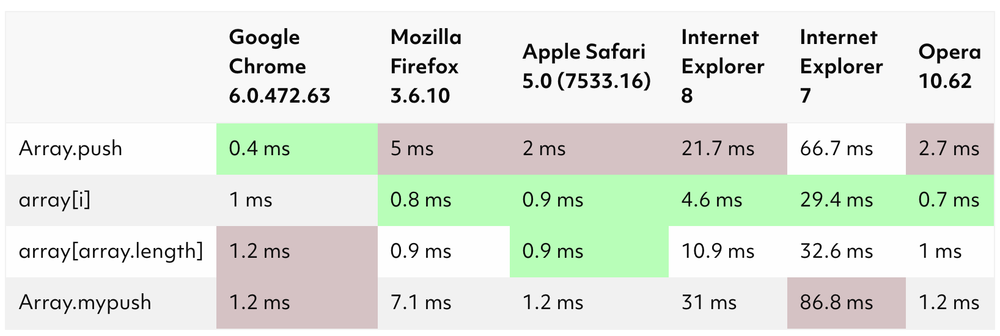

# Basic Algorithm Scripting
a computer algorithm is a sequence of steps that is followed to achieve a particular outcome.
understand the problem -> solve the problem
break problem into chunks and solve them one by one

### Reverse a String
`str.split("").reverse().join("");`

### Factorialize a Number
```javascript
// iteration
function fxactorialize(num) {
  let i = 2;
  let result = 1;
  while(i <= num){
    result *= i
    i++;
  }
  return result;
}

// recursion
function factorialize(num) {
  if (num === 0) { return 1; }
  return num * factorialize(num-1);
}

```
iteration vs. recursion 
In javascript at least, iteration better than recursion, because function calls and returns require state preservation and restoration

*sidenote - Tail call optimization*

### Find the largest numbers in four arrays
```javascript
function largestOfFour(arr) {
  return arr.map(function(group){
    return group.reduce(function(prev, current) {
      return (current > prev) ? current : prev;
    });
  });
}
```
### Function as an argument 
```javascript
function findElement(arr, func) {
  arr = arr.filter(func);
  return arr.length > 0 ? arr[0] : undefined;
}

findElement([1, 2, 3, 4], num => num % 2 === 0);
```

### typeof() to check the types of variables 

### Title Case a Sentence 
```javascript
function titleCase(str){
  return str.toLowerCase().replace(/(^|\s)\S/g, (L) => L.toUpperCase());
}
```

### Slice v. splice
arr.slice(beg,end) return a shallow copy of the array; the original array won't be changed 
arr.splice(start,delCnt,item1,item2...) will change the original array  
```javascript
function frankenSplice(arr1, arr2, n) {
  // It's alive. It's alive!
  let result = [arr2.slice(0,n), ...arr1, ...arr2.slice(n)];
  return result;
}
```
[Let’s get those Javascript Arrays to work fast \| gamealchemist](https://gamealchemist.wordpress.com/2013/05/01/lets-get-those-javascript-arrays-to-work-fast/)

### Falsy Bouncer
1. NaN 
NaN is the only value in JavaScript that is not equal to itself
- not writable, not enumerable, not configurable
- returned value for, ex: `Math.sqrt(-1)` or `parseInt("blaba")`
- testing against NaN
use `isNaN()` or `Number.isNaN()` to determine if the value is NaN
 
```javascript
NaN === NaN;        // false
Number.NaN === NaN; // false
isNaN(NaN);         // true
isNaN(Number.NaN);  // true

function valueIsNaN(v) { return v !== v; }
valueIsNaN(1);          // false
valueIsNaN(NaN);        // true
valueIsNaN(Number.NaN); // true
```
 - isNaN() return true if the value is currently NaN, or if it is going to be NaN after coonvert to a number
  - Number.isNaN() returns true if it is currently NaN
```javascript
isNaN('hello world'); // returns 'true'.
Number.isNaN('hello world'); // returns 'false'.
```
2. find NaN in an array
- arr.indexOf(value) uses strict-equality-operator (===)
- arr.findIndex(); //return index or -1
- arr.indlues(); //true or false
```javascript
function bouncer(arr) {
  // Don't show a false ID to this bouncer.
  const falsy = [false,null,0,"",undefined, NaN];
  let result = arr.filter((value)=>{
    return falsy.includes(value) === false; 
  })
  console.log(result);

  return result;
}
bouncer([1, null, NaN, 2, undefined])
```

### Where do I belong
for(let i = 0; i < arr.length; i++) turns out to be the most efficient way to loop through stuffs....

```javascript
// my solution
function getIndexToIns(arr, num) {
  if(arr.length == 0){
    return 0;
  }
  else{
    let right = 0;
    for(let a of arr){
      a >= num ? right += 1 : null;
    }
    return arr.length - right;
  }
}

getIndexToIns([40, 60], 40);
```
### Mutations
1. ternary operator
condition ? expression1 : expression2
expression cannot have return 
but 
return condition ? exp1 : exp2 is okay

```javascript
// my solution
function mutation(arr) {
  let result = true;
  let lookFor = arr[1].toLowerCase().split("");
  let searchIn = arr[0].toLowerCase().split("");

  for(let char of lookFor){
    if(searchIn.includes(char))
      result = true
    else{
      return false
    } 
  }
  return result;
}

mutation(["Mary", "Aarmy"]);

// better
function mutation(arr) {
  return arr[1].toLowerCase()
    .split('')
    .every((letter) => {
      return arr[0].toLowerCase()
        .indexOf(letter) != -1;
    });
}
```
2. `arr.every()`
a better way to loop through an array
```js
function isBigEnough(element, index, array) {
  return element >= 10;
}
[12, 5, 8, 130, 44].every(isBigEnough);   // false
[12, 54, 18, 130, 44].every(isBigEnough); // true
```

***sidenote: Array performance*** 
<https://gamealchemist.wordpress.com/2013/05/01/lets-get-those-javascript-arrays-to-work-fast/>
Get JavaScript Arrays to workk fast

1. [] is better than {}
2. [integer] is better than [something else]
3. avoid loop backward within an array
4. do not change again and agian the array's size
  => operate on fixed sized arrays whenever possible
  => using over-sized array is way better than changing often the size
```js
var B = [ 0, 0, 0, 0, 0 ] ;    // allocated array of length 5.
var BLength = 0 ;
// to do a 'push', do 
B[BLength++] = 1;
// to do a 'pop' :
var last = B[--BLength] ;
```

[JavaScript Array.push Performance](https://blog.scottlogic.com/2010/10/15/javascript-array-performance.html)

according to Google js style guide, use arr.push() as possible. 
it works the best in Google Chrome, but the worst in other browsers

[JavaScript Array Methods: Mutating vs. Non-Mutating](https://lorenstewart.me/2017/01/22/javascript-array-methods-mutating-vs-non-mutating/)

<hr>

