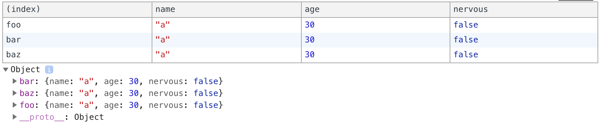

# JavaScript Pro Tips

### Better console.log( )
```javascript
const foo = { name: 'a', age: 30, nervous: false };
const bar = { name: 'a', age: 30, nervous: false };
const baz = { name: 'a', age: 30, nervous: false };


console.log('%c My Friends', 'color:orange'); // add css to console.log
console.table({foo,bar,baz}); // log a nicely looking table
``` 


```javascript
console.time('looper')
let i = 0;
while(i<1000000000){ i++ }
console.timeEnd('looper');
// log the time

const deleteMe = () => console.trace('bye bye database');
deleteMe();
// trace back to where it is defined and where it is called
```

### Destructure the object
```javascript
let obj = {
  name: 1,
  meal: 2,
  diet: false
}

function feed({name,meal,diet}){
  return `Feed ${name} ${meal} ${diet}`
}

// or 
function(obj){
  let {name, meal, diet} = obj;
  return ...
}

```

### Better array
```javascript
const total = orders.reduce((acc,cur) => arr + cur); // get the sum
const withTax = orders.map(v=>v*1.1); // change the value of all items 
const highValue = orders.filter(v=> v>100);
```

### Async
```javascript
const sumRandomAsyncNums = async() => {
  const first = await random();
  const second = await random();
  console.log(`Result ${first + second}`)
}
```
